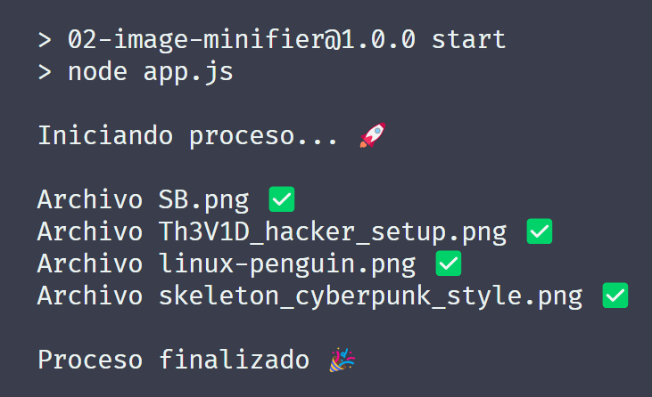

# BackendJourney

Backend development using Node.js and Express.js, with future plans to explore Java, Go, or C#

## 01-ToDoCLI

## 02-ImageMinifier

## 03-WeatherApp

## 04-ToDo-MVC

## 05-ToDo-RestAPI

